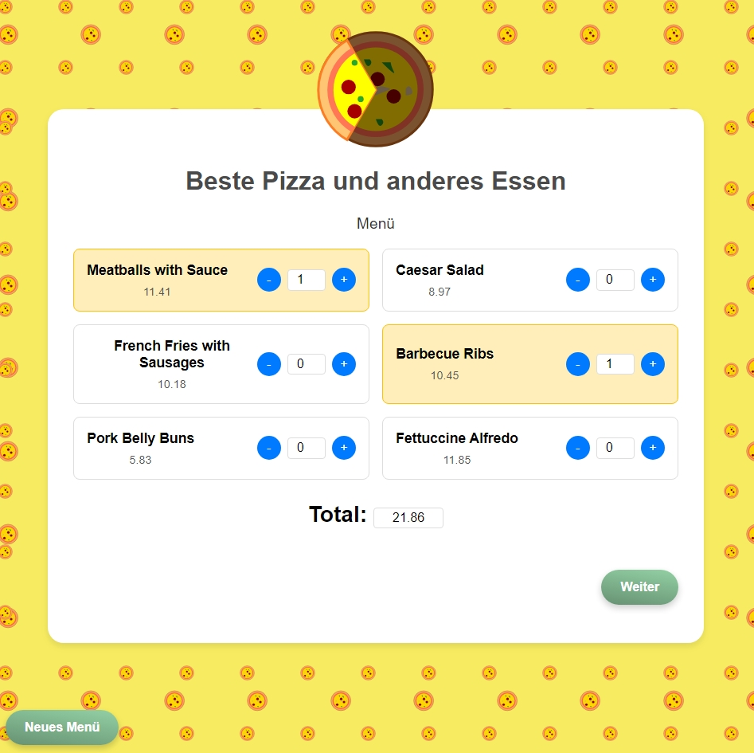

# Pizza Order Site with JSPs

Erstellen Sie eine Reihe von Webformularen, welche zur Essensbestellung über einen Pizzadienst
genutzt werden können. Erstellen Sie dazu ein dynamisches Startformular, und fügen Sie später
über eine JSP einzelne Positionen in eine Bestellung ein. Dann lösen Sie den Bestellvorgang aus.
Sie erhalten danach eine Rechnung, die wiederum dynamisch erzeugt wird.
Es sollte ein Katalog von mindestens 6 verschiedenen Gerichten auf dem Eingangsformular
bereitgestellt werden(Pizza Napoli, Pizza Frutti di Mare, etc.). Die Anzahl der jeweiligen Gerichte
können als Texteingabefelder realisiert werden.

Beispiel: 2 x Pizza Napoli und 3 x Spaghetti sollen an die Adresse
Hans Wurst
Senterweg 22
1234 Lindendorf
zum Gesamtpreis von 12,60 geliefert werden.

Die Daten sollen in eine Collection gespeichert werden. Sie benötigen ein Objekt für den Kunden in
dem die vollständigen Adressdaten angegeben werden.Ein Objekt für die Speisen, als auch ein
Objekt für die Bestellungen in dem, neben den bestellten Speise(n) auch Ip-Adresse und Session-Id
und Kunde mit abgelegt werden.